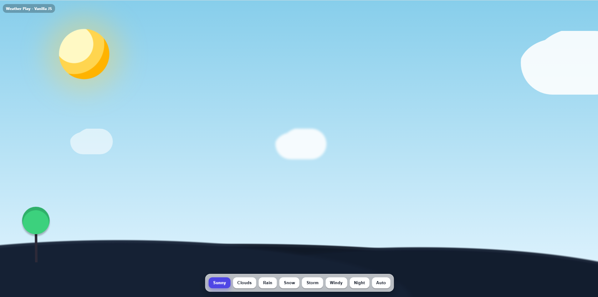

# 🌦️ Weather Animation Effects | HTML, CSS & JavaScript

This project demonstrates **Weather Animation Effects** created using **HTML, CSS, and JavaScript**.  
It includes interactive and creative animations such as **Rain, Snow, Clouds, and Lightning**, making it a fun **frontend project** for beginners and web developers.  

---

## 🚀 Features
- 🌧️ Rain animation  
- ❄️ Snowfall effect  
- ☁️ Floating clouds  
- ⚡ Lightning animation  
- 🎨 Responsive and clean design  
- 💻 Beginner-friendly HTML, CSS & JS project  

---

## 📸 Preview


---

## 🛠️ Technologies Used
- **HTML5**  
- **CSS3 (Animations & Effects)**  
- **JavaScript (DOM & Logic)**  

---

## 📂 Project Setup
1. Clone the repository:
   ```bash
   git clone https://github.com/lifeonthecode/Weather-Animation-Effects